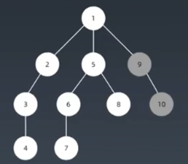
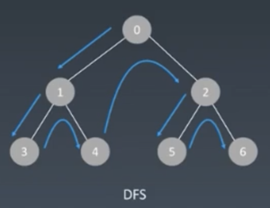
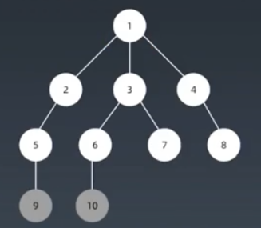
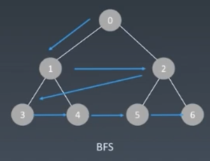

# 搜尋 Search

## 特性

### 	每個節點都要訪問一次

### 	每個節點僅訪問一次

### 	依據訪問順序的不同可分為 DFS 與 BFS

## 1. 深度優先搜尋 Depth first search

### 	實現方式

- 遞歸

- 棧 stack

  

## 2. 廣度優先搜尋 Breadth first search

### 實現方式

- 遞歸
- 隊列 queue

# 貪心 Greedy

## 特性

- ### 每一步採取最好或最優選擇，期許最終極果為最優解

- ### 與動態規劃的差別在於，每個子問題做出選擇後就不能回退