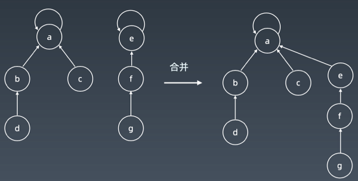
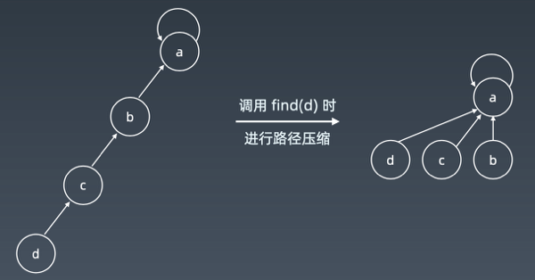
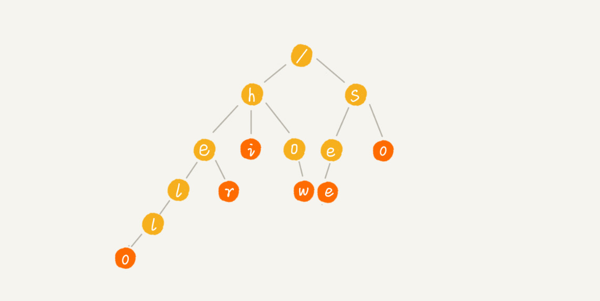

# 學習筆記

## 並查集 Disjoint set

| 初始化                                                       | 查詢與合併                                                   | 路徑壓縮                                                     |
| ------------------------------------------------------------ | ------------------------------------------------------------ | ------------------------------------------------------------ |
|  |  |  |

### 基本操作

- makeSet(s)

	- 建立新的並查集，其中包含s個單元素集合

- unionSet(x, y)

	- 把元素 x 和 y 所在的集合合併

	- 如果兩集合不相交則合併，相交則不合併

- find(x)

	- 找到元素x所在集合的集合代表

	- 此操作可以用於判斷兩個元素是否位於同一集合，只要將他們各自的代表比較一下就可以了

### 應用

- 組團、配對問題

- Group or not

  

## 字典樹 Trie

### 複雜度

- 時間

	- ⭕ 搜尋 O(K)

		- K為字串長度

- 空間

	- Ｏ(26K)以上

		- 很消耗空間的算法，當公共前綴都不重複時，消耗空間很大

### 特性

- 是一種26分叉的多叉樹

- 專門處理字符串匹配的數據結構

- 用來解決在一組字符串集合中快速查找某個字符串的問題

- 每個節點不儲存完整單字

- 從根節點到某一節點，路徑上經過的字符串連接起來，為該節點對應的字符串

- 每個節點的所有子節點路徑代表的字符都不相同

### 核心思想

- 空間換時間

- 利用**字符串的共同前綴**來降低查詢時間的開銷，以提高最高效率

### 優點

- ⭕ 最大限度減少無謂的字符串比較

- ⭕查詢效率比哈希表高

### 基本操作

- insert(String string)

- search(String string)

- startWith(String string)

### 應用

- 統計與排序大量的字符串

- 經常被搜尋引擎系統用於文本詞頻統計

