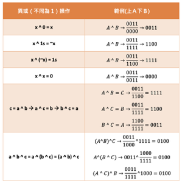

# 學習筆記


## 位運算 Bitwise





## 布隆過濾器 Bloom Filter

### 特性

- 用於檢索一個元素是否在一個集合中

- ⭕ 空間效率和查詢時間都遠遠超過一般的算法

- ❌ 有一定的誤認率和刪除困難

- 當回傳沒找到表示一定不再集合中
  回傳找到數值則數值可能在也可能不在集合中

### 應用

- 比特幣網路
- 分佈式系統 (Map-Reduce)-Hadoop、search engine
- Redis 緩存
- 垃圾郵件、關鍵字評論等的過濾


## LRU Cache (Least Recently Used) 
### 複雜度

- 時間

	- O(1) 查詢

	- O(1) 修改、更新

### 特性

- 一種緩存機制

- 以最近使用時間為重要數據的策略

- 最近使用到的數據就搬到鏈表最開始

- 越久沒被使用的數據最早被淘汰

### 實作方式

- Hash Table + Double LinkedList

### 替換策略

- LFU - least frequently used

- https://en.wikipedia.org/wiki/Cache_replacement_policies


## 排序

#### 冒泡排序

每一回合，每兩個元素比大小，大的往後交換，全部回合結束，排序完成

```java
public int[] sortArray(int[] nums) {
  boolean change = true;
  for (int i=0; change && i<nums.length-1; i++) {
    change = false;
    for (int j=i+1; j<nums.length; j++) {
      if (nums[i] > nums[j]) {
        swap(nums, i, j);
        change = true;
      }
    }
  }

  return nums;
}

private void swap(int [] nums, int index1, int index2) {
  int tmp = nums[index1];
  nums[index1] = nums[index2];
  nums[index2] = tmp;
}
```

#### 插入排序

分成已排序與未排序兩部分，每次遍歷取目前至往前與已排序區域比大小，找尋要插入的位置

當前一個數值比當前大則可以直接進入下一個回合迭代

```java
public int[] sortArray(int[] nums) {
  for (int i=1; i<nums.length; i++) {
    for (int j=i; j>0; j--) {
      if (nums[j-1] > nums[j]) {
        swap(nums, j, j-1);
      } else {
        break;
      }
    }
  }

  return nums;
}
```

### 快速排序

找一個數值，比數值小的在左邊，大的在右邊，在分左右邊遞歸

```java
public static void quickSort(int[] array, int begin, int end) {
    if (end <= begin) return;
    int pivot = partition(array, begin, end);
    quickSort(array, begin, pivot - 1);
    quickSort(array, pivot + 1, end);
}

static int partition(int[] a, int begin, int end) {
    // pivot: 标杆位置，counter: 小于pivot的元素的个数
    int pivot = end, counter = begin;
    for (int i = begin; i < end; i++) {
        if (a[i] < a[pivot]) {
            int temp = a[counter]; 
						a[counter] = a[i]; 
						a[i] = temp;
            counter++;
        }
    }
    int temp = a[pivot]; 
		a[pivot] = a[counter]; 
		a[counter] = temp;
    return counter;
}
```

### 歸併排序

先分區，分到最小單位後，兩兩比較排序，最終排序完成

```java
public static void mergeSort(int[] array, int left, int right) {
    if (right <= left) return;
    int mid = (left + right) >> 1;

    mergeSort(array, left, mid);
    mergeSort(array, mid + 1, right);
    merge(array, left, mid, right);
}

public static void merge(int[] arr, int left, int mid, int right) {
    int[] temp = new int[right - left + 1];
    int i = left, j = mid + 1, k = 0;

    while (i <= mid && j <= right) {
        temp[k++] = arr[i] <= arr[j] ? arr[i++] : arr[j++];
    }

    while (i <= mid)   temp[k++] = arr[i++];
    while (j <= right) temp[k++] = arr[j++];

    for (int p = 0; p < temp.length; p++) {
        arr[left + p] = temp[p];
    }
}
```

